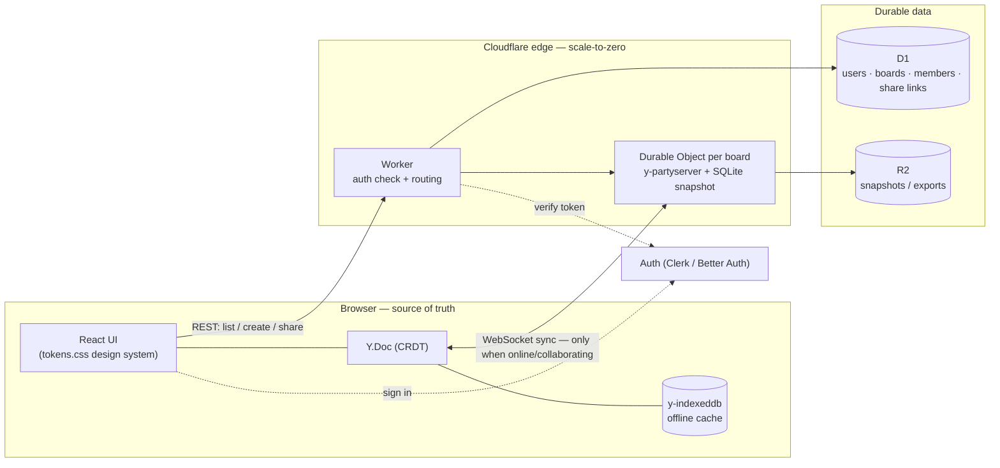
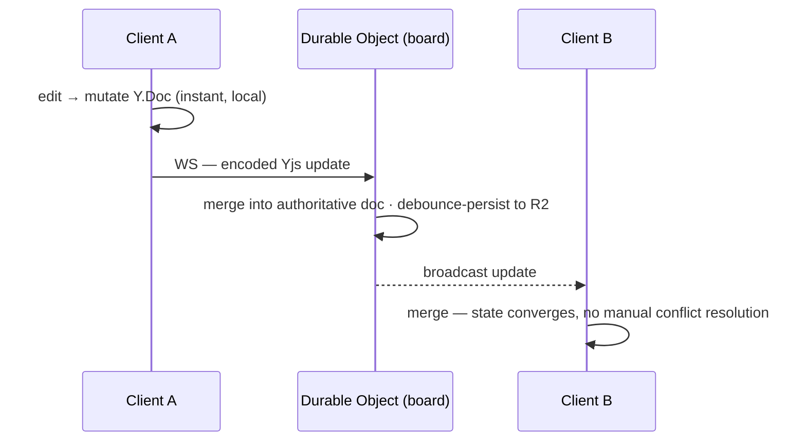

# JotModel — Technical Architecture

**Priorities, in order:** simplicity → cost → expandability. The guiding move is to make the
**client the source of truth** and keep the server doing as little as possible. That is what makes
the MVP free, the system simple, and collaboration/sharing/auth additive rather than a rewrite.

Pricing below was checked mid-2026; always reconcile against live pricing pages before committing.

---

## 1. The core bet: local-first CRDT

The whole architecture turns on one decision: the board is a **CRDT document** (Conflict-free
Replicated Data Type) that lives in the browser, not a record fetched from a server.

- **MVP needs no backend.** The doc lives in memory and persists to the browser (IndexedDB). You
  dogfood it, it loads instantly, it works offline, and it costs nothing to run.
- **Collaboration is additive.** When you want multiplayer, you point the *same* document at a
  sync relay. No data-model rewrite, no migration — the doc was always collaborative-shaped.
- **Presence, offline, and undo come free** from the CRDT toolchain (awareness, IndexedDB
  provider, `UndoManager`).

Recommended CRDT: **Yjs** — the most battle-tested for editors/canvases, with a React ecosystem,
an awareness protocol for live cursors, and multiple sync/persistence providers. (Alternative:
Automerge — also solid, Rust core; smaller canvas ecosystem.)

---

## 2. System at a glance



The dashed paths (auth, REST) and the Durable Object only exist from Phase 2 onward. In Phase 1
the Client box is the entire system.

---

## 3. Stack

| Layer | Pick | Why | Alternative |
|---|---|---|---|
| App | **React + TypeScript + Vite** | Fast, ubiquitous, matches the demo | SolidJS (lighter) |
| Model / sync | **Yjs** (`y-indexeddb`, `y-partyserver/provider`) | Local-first, presence, offline, undo built in | Automerge |
| Canvas render | **Hand-rolled SVG/DOM** (as in the demo) | Total control of the signature interactions — the moat | `@xyflow/react` (React Flow) for pan/zoom/handles if plumbing gets heavy |
| Realtime backend | **Cloudflare Workers + Durable Objects** via `y-partyserver` | One DO per board, WebSocket hibernation, scale-to-zero | Liveblocks / y-sweet (managed, faster to start, higher run-rate) |
| Relational data | **Cloudflare D1** (SQLite) | Cheap, generous free tier, same platform | Supabase Postgres |
| Blob storage | **Cloudflare R2** | No egress fees; snapshots & exports | Supabase Storage / S3 |
| Auth | **Clerk** (50k free) *or* **Better Auth** (self-host, ~$0) | Clerk = fastest DX; Better Auth = cheapest at scale, your DB | Supabase Auth, WorkOS (B2B SSO, 1M free) |
| Hosting | **Cloudflare Pages** | Free static hosting, edge, one vendor | Netlify / Vercel |
| Styling | **`tokens.css`** as CSS variables (optionally mapped into Tailwind) | One source of truth, light/dark | — |

**Why mostly one vendor (Cloudflare):** keeping host + realtime + relational + blob on Cloudflare
means a single bill, a single mental model, and scale-to-zero across the board. Supabase is the
strong alternative when you'd rather have managed Postgres with Row-Level Security doing the
sharing logic for you — at the cost of a second vendor.

---

## 4. Data model

Two stores, by nature of the data:

**A. The board content → the CRDT (`Y.Doc`).** Everything on the canvas. Sketch:

```
Y.Doc (one per board)
├─ entities: Y.Map<id, Y.Map>           // id → { name:Y.Text, x, y, color, fields:Y.Array }
│    └─ fields: Y.Array<Y.Map>          //   { name:Y.Text, type, note }
└─ relationships: Y.Map<id, Y.Map>      // { fromId, fromField, toId, toField,
                                         //   fromCard:'one'|'many', toCard:'one'|'many',
                                         //   role }   // role = the "as" label
```

- `name` as `Y.Text` lets two people edit a table name at once and merge character-by-character;
  use a plain string in the MVP if that's simpler.
- Cardinality is **per end** (`fromCard`/`toCard`) — this is exactly what makes 1:1 / 1:N / N:M
  fall out of toggling each endpoint, and it stores cleanly as `1:N`-style notation.
- `role` carries the **"as"** label; multiple relationships between the same pair are just
  multiple entries with different roles. A self-relationship is simply `fromId === toId`.

**B. Everything *about* the board → relational (D1).** Identity, ownership, and sharing:

```mermaid
erDiagram
  USER ||--o{ BOARD : owns
  BOARD ||--o{ MEMBER : "has access"
  USER ||--o{ MEMBER : "is"
  BOARD ||--o{ SHARE_LINK : "exposes"
  BOARD {
    id pk
    owner_id
    title
    updated_at
    snapshot_ref "R2 key (latest CRDT snapshot)"
  }
  MEMBER { board_id user_id role "owner|editor|viewer" }
  SHARE_LINK { token pk board_id role expires_at }
```

The CRDT holds the *drawing*; D1 holds the *metadata and permissions*. They meet only at
`board.id` and the snapshot reference.

---

## 5. Real-time & offline (designed now, shipped later)



- **Convergence:** CRDT merges are automatic and order-independent; there is no central lock and
  no "save" button. Concurrent moves resolve last-write; concurrent text merges character-level.
- **Presence:** Yjs **awareness** carries live cursors and selections — the multiplayer cursors in
  the design system — over the same socket, and it's ephemeral (never persisted).
- **Offline:** `y-indexeddb` makes the board work with no network and reconcile on reconnect. This
  is on from Phase 1 (it's also how the MVP persists locally).
- **Undo:** Yjs `UndoManager` gives per-user undo/redo scoped to that user's own changes — this is
  what lets the build-spec delete things with **no confirm dialog** and still feel safe.
- **Cost shape:** the Durable Object uses **WebSocket Hibernation**, so a board with no active
  editors bills ~nothing for duration; it wakes on the next message.

---

## 6. Auth & sharing

- **Roles:** `owner` / `editor` / `viewer`, stored in `MEMBER` (D1).
- **Share by link:** a signed, role-scoped, optionally-expiring **capability token** (a
  `SHARE_LINK` row). "Anyone with the link can view/edit" is just a token that grants a role
  without a named account — the send-a-link flow.
- **Authorizing a live session:** to open a board's WebSocket, the client presents its auth token
  (Clerk/Better Auth JWT) or a share token; the **Worker validates it and checks the D1 ACL
  before upgrading the connection** to the Durable Object. The relay never trusts the client.
- **SSO later:** when B2B customers need it, add WorkOS or Clerk's enterprise SSO — the role model
  above doesn't change.

---

## 7. Export pipeline ("strict underneath")

Export is a **pure function of the CRDT model → text**, run entirely client-side (no server, no
cost):

```
model ──► DBML        (entities, fields, refs with cardinality + role)
      ──► dbt          (schema.yml + model stubs)
      ──► SQL DDL      (per-dialect templates: Postgres / MySQL / SQL Server)
```

Because cardinality and roles are first-class in the model (§4), exports carry real foreign keys
and relationship names, not just boxes and lines. This is the bridge from the loose in-room
conversation to a rigorous artifact engineers can use.

---

## 8. Phased rollout (maps to the requirements)

| Phase | Adds | Backend | Run cost |
|---|---|---|---|
| **1 — MVP (now)** | Canvas, create-flow, color-coding, export. Local-first; boards live in the browser; import/export a `.jotmodel` file for portability. | **None** | **~$0** (+ domain) |
| **2 — Accounts & cloud save & link sharing** | Sign-in, boards saved to the cloud, share-by-link (view/edit). Still asynchronous (snapshot-based), not live. | Auth + Worker + D1 + R2 | **~$5/mo** floor |
| **3 — Real-time collaboration** | Live multiplayer editing + presence cursors. The *same* `Y.Doc` now syncs through a Durable Object. | + Durable Object (`y-partyserver`) | $5/mo + light usage |
| **4 — Teams, SSO, comments, history, AI seed** | Org/team spaces, enterprise SSO, comments, version history (snapshot timeline), AI text-to-diagram to seed a board. | + WorkOS/Clerk SSO, snapshot store | scales with usage |

**The payoff to call out:** the client code barely changes between phases 1→3. Phase 1 already
writes to a `Y.Doc`; Phase 3 adds one provider line pointing at the relay. Nothing about the
canvas, the model, or the interactions is rebuilt.

---

## 9. Cost model

Why this is structurally cheap: **the clients hold and merge the state, so the server is a thin
relay with no idle cost.**

- **Phase 1:** Cloudflare Pages (free) + a domain (~$10/yr). **$0/mo.**
- **Phases 2–3:** Cloudflare Workers Paid has a **$5/mo account floor** that already covers Workers,
  Pages Functions, Durable Objects, and KV. Durable Object **hibernation** means idle boards cost
  ~nothing; incoming WebSocket messages bill at a **20:1 ratio** and outgoing are free; D1's free
  tier (multi-GB, tens of millions of reads) and R2 (no egress fees) absorb early metadata/snapshot
  load. Auth is free to **50k users** on Clerk, or ~$0 self-hosted with Better Auth. Realistic bill
  until meaningful traction: **~$5/mo.**
- **At scale:** costs rise gently with active editing, not with stored boards — hundreds of
  concurrent collaborators is still tens of dollars, because hibernation and the 20:1 ratio keep
  the relay cheap. A managed equivalent (Liveblocks, y-sweet) starts faster but bills per MAU /
  connection, so its run-rate climbs sooner.

This matches the lean-infra assumption already in the financial model: a low fixed floor plus
usage that tracks real collaboration.

---

## 10. Alternatives considered

| Option | Verdict |
|---|---|
| **tldraw + tldraw sync** | Canvas + sync out of the box, but it's a *drawing* store; forcing typed entities/relationships/export onto it fights the grain. Good for freeform, wrong for structured modeling. |
| **Liveblocks / y-sweet (managed Yjs)** | Fastest path to multiplayer; less ops. But per-MAU/connection pricing makes it the higher run-rate choice — against the cost priority. Keep as a "buy time" fallback. |
| **Convex / Jazz / Instant (all-in-one local-first)** | Collapse auth + sync + DB into one service — very simple. Younger ecosystems and more opinionated; less control over the CRDT canvas than raw Yjs. Worth a look if simplicity ever outranks control. |
| **Supabase for the whole backend** | Auth + Postgres + RLS + Storage in one vendor; RLS can express sharing cleanly. Realtime isn't CRDT, so you'd still pair it with Yjs+DO for live editing. Free tier pauses when idle. |
| **React Flow (`@xyflow`) vs hand-rolled canvas** | React Flow gives pan/zoom/handles/edges for free and would speed Phase 1 — but the interaction *is* the product, so owning it matters. Recommendation: hand-roll the canvas (you have the demo), adopt React Flow only if plumbing becomes a time sink. |
| **Postgres-as-truth (ElectricSQL) instead of CRDT** | Strong if the relational DB must be authoritative. Heavier than needed for a single-document whiteboard; Yjs is the lighter fit. |

---

## 11. Risks & recommendation

- **CRDT snapshot growth / tombstones.** Long-lived docs accumulate history. Mitigate with
  periodic snapshot compaction stored in R2; keep a bounded version history for Phase 4.
- **One-control-two-actions** (click vs. drag on a relationship endpoint) and **no-confirm
  deletes** are deliberate (see the build-spec); both lean on `UndoManager`. If testing shows
  either feels risky, the fallbacks are already noted.
- **Vendor concentration on Cloudflare.** Accepted trade for cost + simplicity; the CRDT model is
  portable (Yjs runs on any WebSocket relay), so the relay is replaceable without touching the app.

**Recommendation:** ship Phase 1 as a local-first SPA on Cloudflare Pages — zero backend, zero run
cost, and it already proves the interaction. Keep every board a `Y.Doc` from line one. Add the
Durable Object relay only when a second person needs to be in the room. That sequence gives you the
cheapest possible start and a straight, rewrite-free path to sharing, real-time, and auth.
